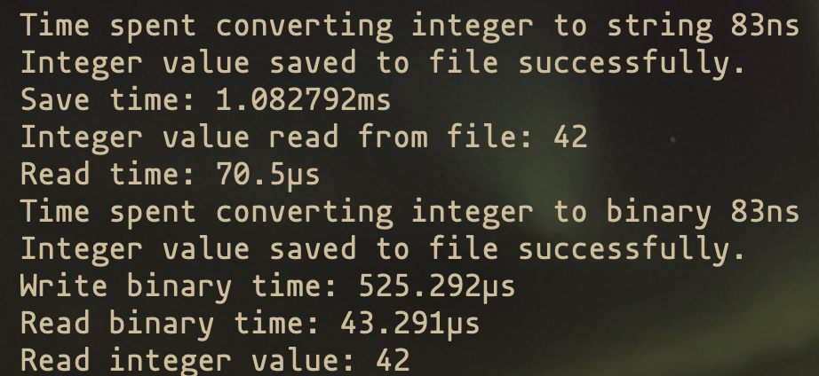
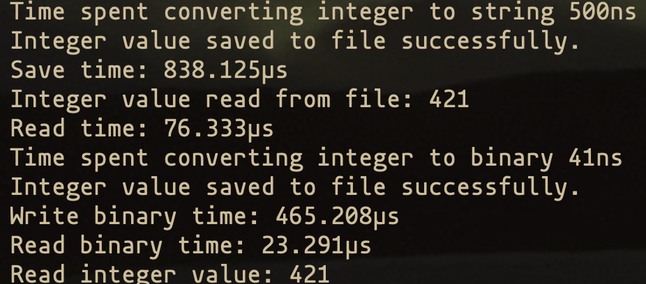

## String vs Binary Data

- Save integer as string in file, steps involved -
  - Convert integer to string - Using itoa() function, which has an interesting optimization for two digit numbers - [Commit](https://cs.opensource.google/go/go/+/bc8b9b23ca3f33e738d85c4734bd35dfe63e9ac4), [CodeRef](https://cs.opensource.google/go/go/+/master:src/strconv/itoa.go;l=68-78;drc=20130cc36a17ba131b80cc8674f1ef8d002e9dbe?q=strconv&ss=go%2Fgo). 
  - Write string to file - Using `WriteString` function, which internals converts string to bytes. Then calls `Write` function to write bytes to file.
- Save integer as binary encoded data in file, steps involved -
  - Convert integer to binary encoded data - Using `binary.LittleEndian.PutUint64` function, which converts integer to bytes.
  - Write binary encoded data to file - Using `Write` function to write bytes to file.

The string path has a extra step of converting integer to string first then to bytes, whereas the binary path makes that conversion to bytes in binary encoded form much quicker.

### Benchmark

